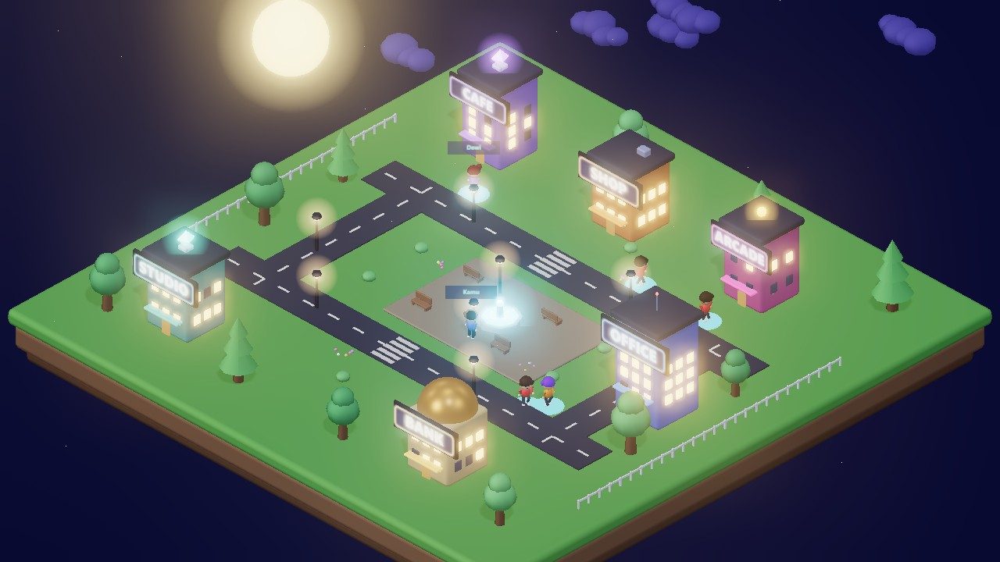

<div align="center">

# Mighan World

**Kota 3D tempat AI agent tinggal dan bekerja — jalan penuh di browser.**

[**▶ Buka demo**](https://fahmiwol.github.io/mighan-world/) · [Mighan Town](https://fahmiwol.github.io/mighan-world/town.html) · [World Builder](https://fahmiwol.github.io/mighan-world/builder.html)



*Tanpa install. Tanpa login. Tanpa backend. Buka tautannya, langsung jalan.*

</div>

---

## Apa ini

Kota isometrik kecil yang bisa kamu masuki: berjalan pakai **WASD** atau klik tanah,
dekati gedung lalu tekan **E** untuk melihat apa yang diwakilinya. Warga kota berjalan
sendiri di trotoar. Semuanya dirender langsung di browser dengan Three.js — tidak ada
server yang menghitung apa pun.

Ini bagian publik dari **Mighan**, dunia 3D tempat AI agent punya persona, pekerjaan,
dan rutinitas sendiri.

## Coba dalam 10 detik

```
buka https://fahmiwol.github.io/mighan-world/town.html
WASD / klik tanah  → jalan
dekati gedung + E  → lihat fiturnya
scroll             → zoom, drag → putar kamera
```

Mau menjalankan sendiri? Tidak perlu build step:

```bash
git clone https://github.com/fahmiwol/mighan-world.git
cd mighan-world
python -m http.server 8080     # atau server statis apa pun
```

## Isi

| Halaman | Isi |
|---|---|
| [`town.html`](https://fahmiwol.github.io/mighan-world/town.html) | **Mighan Town** — kota malam, bisa dijelajahi, 6 gedung = 6 fitur |
| [`builder.html`](https://fahmiwol.github.io/mighan-world/builder.html) | **World Builder** — susun duniamu: objek, NPC, cat lantai, zona berlabel |
| [`avatar-studio.html`](https://fahmiwol.github.io/mighan-world/avatar-studio.html) | Rancang karakter chibi |
| [`city-hero.html`](https://fahmiwol.github.io/mighan-world/city-hero.html) | Versi siang yang berputar sendiri (dipakai sebagai embed) |
| [`sandbox.html`](https://fahmiwol.github.io/mighan-world/sandbox.html) | Ruang uji renderer |

## Yang menarik secara teknis

**Semua geometri dibuat kode, bukan diimpor.** Gedung, pohon, lampu jalan, air mancur,
awan — semuanya `RoundedBoxGeometry` dan primitif yang disusun saat runtime
([`toytown.js`](toytown.js)). Papan neon digambar ke `<canvas>` lalu dijadikan tekstur
dengan `toneMapped: false`, supaya tetap menyala saat kena bloom.

**Awan dikunci ke band langit layar.** Pada kamera isometrik ortografik, awan yang
digerakkan di ruang dunia gampang melintas menutupi kota. Di sini posisi dunianya
dihitung balik dari koordinat layar, jadi awan selalu melayang di atas kota berapa pun
sudut kameranya.

**Avatar chibi prosedural** — dibangun dari bola dan silinder, dengan variasi warna
deterministik dari seed nama, jadi NPC yang sama selalu tampil sama
([`chibi-avatar-builder.js`](chibi-avatar-builder.js)).

**Renderer yang bisa dipakai ulang.** [`world-lite.js`](world-lite.js) memuat scene dari
JSON deklaratif dan memancarkan event ke halaman induk lewat `postMessage` — jadi bisa
di-embed di aplikasi lain.

## Stack

Three.js r0.180 lewat CDN (importmap) · tanpa bundler, tanpa dependensi npm ·
kamera isometrik ortografik · bloom opsional · model NPC dari
[Quaternius](https://quaternius.com/) (CC0).

## Lisensi

MIT — lihat [LICENSE](LICENSE).

Repo ini salinan siap-host dari `world-lite` (bagian publik dari engine Mighan).
Untuk mengubah mesin renderer-nya, ubah di repo utama lalu salin ke sini, supaya tidak
lahir dua versi yang menyimpang.
